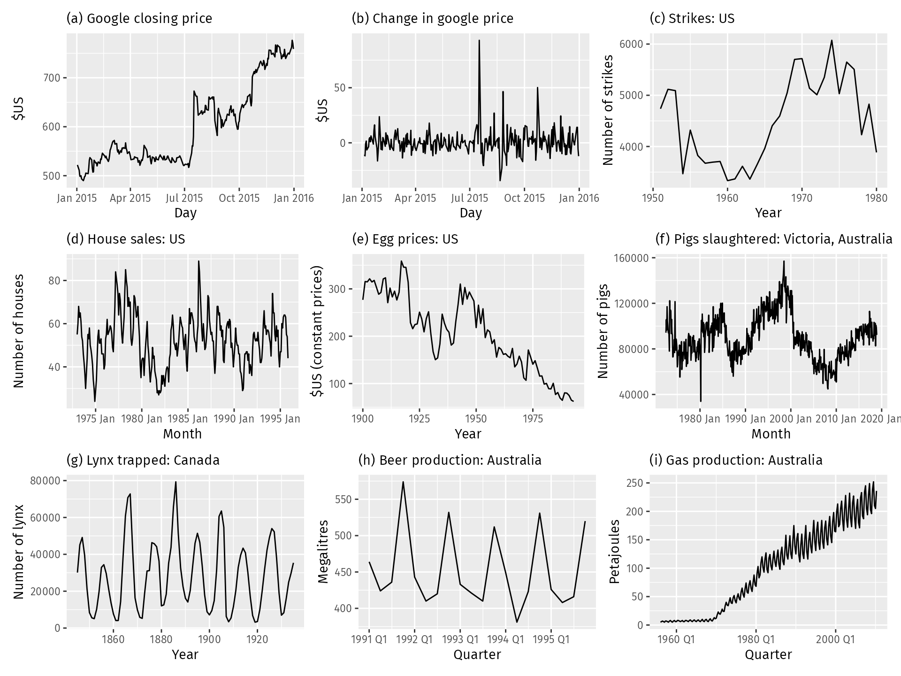
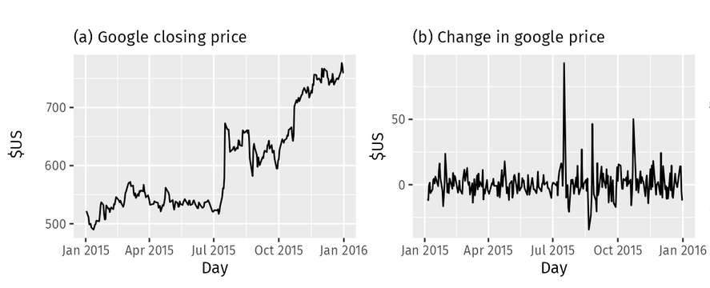
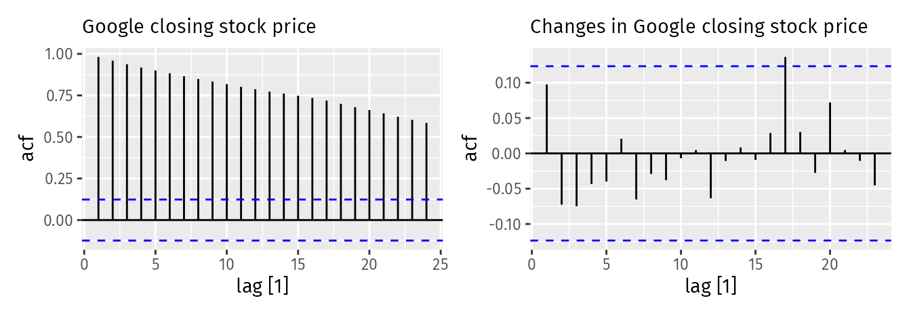

# Introducción

## ¿Qué son los modelos ARIMA?

- ARIMA (AutoRegressive Integrated Moving Average) son una familia de modelos **para series de tiempo estacionarias** ampliamente reconocidos y utilizados para la predicción de series temporales.

- Combinan tres componentes fundamentales:
  - **AR**: Autoregresivo (dependencia del pasado)
  - **I**: Integración (diferenciación para estacionariedad)
  - **MA**: Medias Móviles (dependencia de errores pasados)

- El elemento autorregresivo (AR) relaciona el valor actual con valores pasados (lags)
- El elemento de media móvil (MA) asume que el error de predicción es una combinación lineal de los errores de predicción pasados. 
- Por último, el componente integrado (I) indica que se han aplicado diferencias entre valores consecutivos de la serie original (y este proceso de diferenciación puede haberse realizado más de una vez).

**Notación**: ARIMA(p, d, q)

- p = orden autoregresivo
- d = orden de diferenciación
- q = orden de medias móviles

Antes de introducir los modelos ARIMA, debemos analizar primero el concepto de **estacionariedad y la técnica de diferenciación de series temporales**.

## Contenido

1. **Proceso estocástico y estacionariedad**
2. **Modelos MA(q)** - Medias Móviles
3. **Modelos AR(p)** - Procesos Autoregresivos
4. **Modelos ARMA(p,q)** - Combinación

# Conceptos Fundamentales

## Estacionariedad

::: {.callout-important}
La estacionariedad significa que las propiedades estadísticas (media, varianza, etc) **permanecen constantes a lo largo del tiempo**, por lo que las series temporales con tendencias o estacionalidad no son estacionarias.
:::


**¿Por qué es importante?**

::: {.incremental}
- Los modelos ARIMA requieren estacionariedad (media constante)
- Propiedades estadísticas constantes en el tiempo
- Permite hacer inferencia y pronóstico
:::

## ¿Qué serie es estacionaria?

{width="900px"}


## Nota series estacionarias

::: {.callout-important}

Algunos casos pueden resultar confusos: una serie temporal con **comportamiento cíclico (pero sin tendencia ni estacionalidad) es estacionaria.** Esto se debe a que los **ciclos no tienen una duración fija**, por lo que, antes de observar la serie, no podemos estar seguros de dónde se encontrarán los picos y los valles de los ciclos.

En general, una **serie temporal estacionaria no presentará patrones predecibles a largo plazo.** Los gráficos de la serie mostrarán una trayectoria aproximadamente horizontal (aunque es posible cierto comportamiento cíclico), con una varianza constante.

:::

## Detectar las series no estacionarias

Existen varios métodos para evaluar si una serie temporal es estacionaria o no estacionaria:

- **Inspección visual de la serie temporal:** inspeccionando visualmente el gráfico de la serie temporal, es posible identificar la presencia de una tendencia o estacionalidad notables. Si se observan estos patrones, es probable que la serie no sea estacionaria.
    - ACF : series estacionarias rápidamente converge a cero. Por lo contrario, series **no estacionarias decrecen lentamente.**

- **Valores estadísticos:** calcular estadísticos como la media y la varianza, de varios segmentos de la serie. Si existen diferencias significativas, la serie no es estacionaria.

- **Pruebas estadísticas:** utilizar test estadísticos como la prueba Dickey-Fuller aumentada o la prueba Kwiatkowski-Phillips-Schmidt-Shin (KPSS).

## Diferenciación

::: {.callout-important}
La diferenciación puede ayudar a estabilizar la media de una serie temporal eliminando cambios en el nivel de una serie temporal y, por lo tanto, eliminando (o reduciendo) la tendencia y la estacionalidad.
:::

$$
\Delta y_t = y_t - y_{t-1}
$$

- Esta es conocida como diferenciación de primer orden. Este proceso se puede repetir si es necesario hasta que se alcance la estacionariedad deseada.



### Estacionariedad Débil (o de segundo orden)

Un proceso $\{Y_t\}$ es **débilmente estacionario** si:

1. $E[Y_t] = \mu$ (constante) $\forall t$
2. $Var(Y_t) = \sigma^2$ (constante) $\forall t$
3. $Cov(Y_t, Y_{t+k}) = \gamma_k$ (solo depende del rezago $k$)

## Función de Autocorrelación (ACF)

- Además del gráfico temporal de los datos, el gráfico de la ACF también es útil para identificar series temporales no estacionarias. 
- En una serie temporal estacionaria, la ACF **se reducirá a cero con relativa rapidez**, mientras que en datos no estacionarios la ACF **disminuye lentamente**. 
- Además, para datos no estacionarios, el valor de $\rho_1$ suele ser alto y positivo.



$$
\rho_k = \frac{\gamma_k}{\gamma_0} = \frac{Cov(Y_t, Y_{t-k})}{Var(Y_t)}
$$

**Propiedades**:

- $\rho_0 = 1$
- $-1 \leq \rho_k \leq 1$
- $\rho_k = \rho_{-k}$ (simétrica)

## Función de Autocorrelación Parcial (PACF)

La **PACF** mide la correlación entre $Y_t$ y $Y_{t-k}$ eliminando el efecto de los rezagos intermedios.

$$
\phi_{kk} = Corr(Y_t, Y_{t-k} | Y_{t-1}, ..., Y_{t-k+1})
$$


## Prueba de Dickey-Fuller aumentada (ADF)

::::: {.callout-important}
La prueba Dickey-Fuller aumentada considera como hipótesis nula que la **serie temporal tiene una raíz unitaria**, una característica frecuente de las series temporales no estacionarias. 
:::

$$
\Delta y_t = \alpha + \beta t + \gamma y_{t-1} + \sum_{i=1}^{k} \delta_i \Delta y_{t-i} + \varepsilon_t
$$

- $\Delta y_t$​: Representa la primera diferencia de la serie en el tiempo t, definida como yt​−yt−1​.
- $\alpha$: Es el término constante o intercepto (drift).
- $\beta t$: Es el coeficiente de la tendencia lineal en el tiempo.
- $\gamma$: Es el coeficiente de interés principal. Se prueba la hipótesis nula H0​:$\gamma=0$ (existe raíz unitaria) frente a la alternativa H1​:$\gamma < 0$ (la serie es estacionaria).
- $\sum_{i=1}^{k} \delta_i \Delta y_{t-i}$: Son los términos de rezagos (lags) de la variable diferenciada. El propósito de estos términos es eliminar la autocorrelación en los residuos.
- $\varepsilon_t$​: Es el término de error (ruido blanco).

**Prueba de hipótesis que la serie es estacionaria.**

- Hipótesis nula (HO): La serie tiene una raíz unitaria, no es estacionaria.
- Hipótesis alternativa (HA): La serie no tiene raíz unitaria, es estacionaria.

Dado que la hipótesis nula supone la presencia de una raíz unitaria, el p-value obtenido debe ser inferior a un nivel de significación determinado, a menudo fijado en 0.05, para rechazar esta hipótesis. Este resultado indica la estacionariedad de la serie. 

## Prueba Kwiatkowski-Phillips-Schmidt-Shin (KPSS).

::::: {.callout-note}
La prueba KPSS comprueba si una serie temporal es estacionaria en torno a una media o una tendencia lineal. 
:::

$$
y_t = \xi t + r_t + \varepsilon_t
$$

- $r_t$​ es una caminata aleatoria: $r_t​=r_{t−1​}+u_t$​, donde $u_t \sim N(0,\sigma^2​)$.
- $\xi t$ es una tendencia determinista.
- $\varepsilon_t$​ es un error estacionario.

- En esta prueba, la hipótesis nula es que la serie es estacionaria. Por consiguiente, los p-values pequeños (por ejemplo, inferiores a 0.05) rechazan la hipótesis nula y sugieren que es necesario diferenciar.

## Nota acerca de KPSS y ADF

::::: {.callout-note}
 - Si bien ambas pruebas se utilizan para comprobar la estacionariedad:

- La prueba KPSS se centra en la presencia de tendencias. Un p-value bajo indica la no estacionariedad debida a una tendencia.
- La prueba ADF se centra en la presencia de una raíz unitaria. Un p-value bajo indica que la serie temporal no tiene una raíz unitaria, lo que sugiere que podría ser estacionaria.

- Es habitual utilizar ambas pruebas a la vez para comprender mejor las propiedades de estacionariedad de una serie temporal. 
:::

## Concepto de proceso ruido blanco

::: {.callout-note}
- El ruido blanco (White Noise) es una serie de tiempo que **no muestra autocorrelación** o una autocorrelación **cercana a cero**. Representa la parte de los datos que es puramente aleatoria.
- Por definición el **proceso ruido blanco es estacionario**.
:::

### Definición matemática

Se dice que $\{\varepsilon_t\}$ es un proceso de **ruido blanco** si cumple:

- **Media nula:** $E[\varepsilon_t] = 0$
- **Varianza constante:** $Var(\varepsilon_t) = \sigma^2$
- **Ausencia de autocorrelación:** $\text{Corr}(\varepsilon_t, \varepsilon_{t-k}) = 0$ para todo $k \neq 0$

Si además los errores siguen una distribución normal, hablamos de **Ruido Blanco Gaussiano**:
$$
\varepsilon_t \sim \text{IID} N(0, \sigma^2)
$$

```{python}
#| fig-cap: "Serie de Ruido Blanco y su ACF (Python)"
import numpy as np
import pandas as pd 
import matplotlib.pyplot as plt
from statsmodels.graphics.tsaplots import plot_acf
from statsmodels.stats.diagnostic import acorr_ljungbox

# Generar 200 observaciones de ruido blanco gaussiano
np.random.seed(42)
white_noise = np.random.normal(0, 1, 200)

# Graficar la serie y el ACF
fig, axes = plt.subplots(1, 2, figsize=(14, 5))

# Gráfico de la serie temporal
axes[0].plot(white_noise, color='steelblue')
axes[0].set_title('Proceso de Ruido Blanco')
axes[0].axhline(0, color='red', linestyle='--', linewidth=1)

# Gráfico de Autocorrelación (ACF)
plot_acf(white_noise, ax=axes[1], lags=40)
axes[1].set_title('Autocorrelación (ACF)')

plt.tight_layout()
plt.show()

# Realizar la prueba para los primeros 10 rezagos
res = acorr_ljungbox(white_noise, lags=[10], return_df=True)
print(res)

# Estadisticos
print("-" * 30)
print(f"Media : {np.mean(white_noise)}")
print(f"Varianza : {np.var(white_noise)}")
```

## Modelo de caminata aleatoria

- El modelo de Caminata Aleatoria (o Random Walk) es uno de los conceptos pilares en el análisis de series de tiempo, especialmente en finanzas y econometría. Se utiliza para describir procesos donde el valor de una variable en el tiempo t depende únicamente de su valor anterior más un componente impredecible (ruido blanco).

$$
y_t = y_{t-1} + \varepsilon_t.
$$


Los modelos de caminata aleatoria se utilizan ampliamente para datos no estacionarios, en particular datos financieros y económicos. La caminata aleatoria suelen presentar:

- No Estacionariedad: Una caminata aleatoria es el ejemplo clásico de una serie no estacionaria. Su varianza aumenta con el tiempo, lo que significa que a largo plazo la serie se aleja de su origen.
- Cambios de dirección: Largos periodos de aparentes tendencias al alza o a la baja repentinos e impredecibles
- Memoria Infinita: Cada choque aleatorio $\varepsilon_t$​ persiste para siempre en el nivel de la serie. No hay un "regreso a la media".
- Raíz Unitaria: Si aplicamos la prueba de Dickey-Fuller Aumentada que vimos antes, el coeficiente $\gamma$ sería igual a 0, confirmando que la serie tiene una raíz unitaria.

- Los pronósticos de un modelo $y_t$ de paseo aleatorio **son iguales a la última observación**, ya que los movimientos futuros son impredecibles y tienen la misma probabilidad de ser al alza o a la baja. Por lo tanto, el modelo de paseo aleatorio sustenta los pronósticos ingenuos.

```{python}
import numpy as np
import matplotlib.pyplot as plt

np.random.seed(42)
t_sim = np.arange(100)  # 100 pasos
n_series = range(1, 4)     # 3 series (1, 2, 3)
random_y = {}

for i in n_series:
    y_t = []
    for t in range(len(t_sim)):
        e = np.random.normal(0, 1)
        if t == 0:
            y_t.append(e)
        else:
            y_t.append(y_t[t - 1] + e)
    random_y[f"y_{i}"] = y_t

# 2. Graficamos
fig, ax = plt.subplots(figsize=(10, 5))
for key, value in random_y.items():
    ax.plot(t_sim, value, label=key)
ax.set_title('Distintas realizaciones de Caminata Aleatoria Y_t')
ax.set_xlabel('Tiempo')
ax.set_ylabel('y_t')
ax.legend()
ax.grid(True, alpha=0.3)
plt.show()

```

## Ejercicio 1. Identificar estacionariedad

- Descarga la serie del PIB de Colombia anual y la serie del precio de las acciones diarias de Google. A ambas series vas a realizar:

- Gráfica la serie temporal.
- Calcula estadísticas descriptivas básicas.
- Realiza el ACF diagnostico de la serie.
- Realiza el test de Dickey-Fuller Aumentado (ADF) para verificar estacionariedad.
- Interpreta el resultado del test ADF: ¿Es la serie estacionaria?
- Corrige si no es estacionaria con la diferenciación.

# Modelos MA(q)

## MA de Primer Orden

- Sea $\varepsilon_t$ un proceso ruido blanco, definimos a MA(1) así:
$$
Y_t = \mu + \varepsilon_t + \theta \varepsilon_{t-1}
$$

- Donde $\mu$ y $\theta$ son constantes.
- $Y_t$  es construido de una suma ponderada se los 2 mas recientes valores de $\varepsilon_t$
- Este proceso es estacionario en covarianza

**Propiedades**:

- Media: $E[Y_t] = \mu$
- Varianza: $Var(Y_t) = \sigma^2(1+\theta^2)$
- Autocovarianza:
    - $E(Y_t - \mu)(Y_{t-1} - \mu) = \theta \sigma^2$
    - $E(Y_t - \mu)(Y_{t-j} - \mu) = 0$ para $j > 1$
- ACF: 
  - $\rho_1 = \frac{\theta}{1+\theta^2}$
  - $\rho_k = 0$ para $k > 1$
- PACF: decaimiento exponencial

## Proceso de Medias Móviles de orden q MA(q) 

### Definición

$$Y_t = \mu + \varepsilon_t + \theta_1 \varepsilon_{t-1} + \theta_2 \varepsilon_{t-2} + ... + \theta_q \varepsilon_{t-q}$$

donde:

- $\varepsilon_t \sim WN(0, \sigma^2)$
- $\theta_1, ..., \theta_q$ son los parámetros de medias móviles
- $\mu$ es la media del proceso

::: {.callout-note}
**Interpretación**: El valor actual es una combinación lineal de shocks aleatorios actuales y pasados.
::: 

## MA(q): Propiedades Generales

**Autocorrelación**:

$$
\rho_k = \begin{cases}
\frac{\sum_{j=0}^{q-k} \theta_j \theta_{j+k}}{\sum_{j=0}^{q} \theta_j^2} & k = 1, 2, ..., q \\
0 & k > q
\end{cases}
$$

donde $\theta_0 = 1$.

**Característica**: ACF se anula después del rezago q (memoria finita).

## Identificación de MA(q)

| Característica | MA(q) |
|----------------|-------|
| **ACF** | Corte abrupto después del rezago q |
| **PACF** | Decae gradualmente (exponencial o sinusoidal) |
| **Orden** | q = último rezago significativo en ACF |

> **Regla práctica**: Si ACF tiene corte claro en rezago q y PACF decae → MA(q)

## Invertibilidad de MA(q)

- Usando el operador de rezago $L$, el proceso MA(q) se escribe como:
$$
Y_t = \mu + (1 + \theta_1 L + \theta_2 L^2 + ... + \theta_q L^q)\varepsilon_t = \mu + \theta(L)\varepsilon_t
$$

::: {.callout-important}
Un proceso MA(q) es **invertible** si y solo si todas las raíces del polinomio característico $\theta(z) = 0$ están **fuera** del círculo unitario.
:::

**¿Por qué importa?**

- La invertibilidad garantiza que exista una **única** representación MA(q) para una función de autocovarianzas dada (sin ella, distintos $\theta$ producen la misma ACF).
- Permite expresar el proceso como un AR(∞): $\varepsilon_t$ queda escrito en función de los valores pasados de $Y_t$, lo cual es necesario para poder estimar los residuos y ajustar el modelo.

**Ejemplo MA(1)**: $Y_t = \mu + \varepsilon_t + \theta \varepsilon_{t-1}$

- Invertible si $|\theta| < 1$

## Simulación

- Simulamos los procesos :
$$
MA(1): y_t = \epsilon_t + 0.7 * \epsilon_{t-1} \\
MA(2): y_t = \epsilon_t + 0.6 * \epsilon_{t-1} + 0.3 * \epsilon_{t-2}
$$

```{python}
import numpy as np
import pandas as pd
import matplotlib.pyplot as plt
from statsmodels.tsa.arima_process import ArmaProcess
from statsmodels.graphics.tsaplots import plot_acf, plot_pacf

def plot_proceso_ma(process, title):
    # Generar 500 muestras del proceso
    np.random.seed(42)
    data = process.generate_sample(nsample=500)
    
    fig, axes = plt.subplots(1, 3, figsize=(20, 4))
    
    # Gráfico Temporal
    axes[0].plot(data, color='teal', alpha=0.8)
    axes[0].set_title(f'Serie Temporal {title}')
    axes[0].axhline(0, color='red', linestyle='--', linewidth=1)
    
    # ACF
    plot_acf(data, ax=axes[1], lags=20, title=f'ACF {title}')
    
    # PACF
    plot_pacf(data, ax=axes[2], lags=20, title=f'PACF {title}', method='ywm')
    
    plt.tight_layout()
    plt.show()

# Nota: statsmodels usa el formato (1, theta_1, theta_2, ...) 
# para el polinomio de medias móviles.

# MA(1): y_t = epsilon_t + 0.7 * epsilon_{t-1}
ma1_params = np.array([1, 0.7])
ar1_params = np.array([1]) # Sin parte AR
process_ma1 = ArmaProcess(ar1_params, ma1_params)

# MA(2): y_t = epsilon_t + 0.6 * epsilon_{t-1} + 0.3 * epsilon_{t-2}
ma2_params = np.array([1, 0.6, 0.3])
process_ma2 = ArmaProcess(ar1_params, ma2_params)

# Ejecutar visualizaciones
plot_proceso_ma(process_ma1, "MA(1) con $\\theta=0.7$")
plot_proceso_ma(process_ma2, "MA(2) con $\\theta=[0.6, 0.3]$")

```

# Modelos AR(p)

## Modelo Autoregresivo de Orden 1 AR(1)

$$Y_t = \phi Y_{t-1} + \varepsilon_t, \quad |\phi| < 1$$

**Propiedades**:

- Media: $E[Y_t] = 0$
- Varianza: $Var(Y_t) = \frac{\sigma^2}{1-\phi^2}$
- ACF: $\rho_k = \phi^k$ (decaimiento exponencial)
- PACF: $\phi_{1,1} = \phi$, $\phi_{kk} = 0$ para $k > 1$

**Identificación**:
- ACF: decae gradualmente
- PACF: corte abrupto después del rezago 1

**Condiciones de estacionariedad**:
- Si $|\phi| < 1$ : existe un procesos estacionario para $Y_t$
- Si $|\phi| \geq 1$ : NO existe un procesos estacionario para $Y_t$ con varianzas finitas. 
- Si $\phi = 1$: camino aleatorio (no estacionario)

## AR(2)

$$
Y_t = \phi_1 Y_{t-1} + \phi_2 Y_{t-2} + \varepsilon_t
$$

**Condiciones de estacionariedad**:
1. $\phi_1 + \phi_2 < 1$
2. $\phi_2 - \phi_1 < 1$
3. $|\phi_2| < 1$

**Comportamiento de la ACF**:
- Decaimiento exponencial o sinusoidal amortiguado
- Depende de si las raíces son reales o complejas

## Simulación AR(1) y AR(2)

$$
AR(1): y_t = 0.7 * y_{t-1} + \epsilon_t \\
AR(2): y_t = 0.5 * y_{t-1} + 0.25 * y_{t-2} + \epsilon_t
$$

```{python}
import numpy as np
import pandas as pd
import matplotlib.pyplot as plt
from statsmodels.tsa.arima_process import ArmaProcess
from statsmodels.graphics.tsaplots import plot_acf, plot_pacf

def plot_proceso_ar(process, title):
    # Generar 500 muestras
    np.random.seed(42)
    data = process.generate_sample(nsample=500)
    
    fig, axes = plt.subplots(1, 3, figsize=(18, 5))
    
    # Gráfico Temporal
    axes[0].plot(data, color='darkslateblue', alpha=0.8)
    axes[0].set_title(f'Serie Temporal {title}')
    axes[0].axhline(0, color='red', linestyle='--', linewidth=1)
    
    # ACF
    plot_acf(data, ax=axes[1], lags=20, title=f'ACF {title}')
    
    # PACF
    plot_pacf(data, ax=axes[2], lags=20, title=f'PACF {title}', method='ywm')
    
    plt.tight_layout()
    plt.show()

# Nota: statsmodels usa el formato (1, theta_1, theta_2, ...) 
# para el polinomio de medias móviles.

# AR(1): y_t = 0.7 * y_{t-1} + epsilon_t
ar1_params = np.array([1, -0.7])
ma_params = np.array([1]) # Sin parte MA
process_ar1 = ArmaProcess(ar1_params, ma_params)

# AR(2): y_t = 0.5 * y_{t-1} + 0.25 * y_{t-2} + epsilon_t
ar2_params = np.array([1, -0.5, -0.25])
process_ar2 = ArmaProcess(ar2_params, ma_params)

# Ejecutar visualizaciones
plot_proceso_ar(process_ar1, "AR(1) con $\\phi=0.7$")
plot_proceso_ar(process_ar2, "AR(2) con $\\phi=[0.5, 0.25]$")
```

## Operador de Rezagos

- Definimos el **operador de rezago** $L$: $L Y_t = Y_{t-1}$ , $L^2 Y_t = Y_{t-2}$, $L^k Y_t = Y_{t-k}$
- El modelo AR(2) se puede escribir como:
$$
Y_t = \phi_1 Y_{t-1} + \phi_2 Y_{t-2} + \varepsilon_t \\
Y_t = \phi_1 L Y_t + \phi_2 L^2 Y_t + \varepsilon_t \\
(1 - \phi_1 L - \phi_2 L ^2) Y_t = \varepsilon_t
$$

**Polinomio característico**: $1 - \phi_1 z - \phi_2 z^2 = 0$
**Solución polinomio** : $1 - \phi_1 z - \phi_2 z^2 = (1 - \lambda_1  L)(1 - \lambda_2  L)$

## Condición de Estacionariedad polinomio característico

Un proceso AR(p) es **estacionario** si y solo si:

> Todas las raíces del polinomio característico $\phi(z) = 0$ están **fuera** del círculo unitario.

Equivalentemente: $|\phi_i| < 1$ para todas las raíces.

**Ejemplo AR(1)**: $Y_t = \phi Y_{t-1} + \varepsilon_t$

- Estacionario si $|\phi| < 1$
- Si $\phi = 1$: raíz unitaria. En este caso, la ecuación se convierte en una caminata aleatoria (no estacionario)

## Modelo Autoregresivo de Orden p

### Definición

$$
Y_t = c + \phi_1 Y_{t-1} + \phi_2 Y_{t-2} + ... + \phi_p Y_{t-p} + \varepsilon_t
$$

donde:

- $\varepsilon_t \sim WN(0, \sigma^2)$ (ruido blanco)
- $\phi_1, ..., \phi_p$ son los parámetros autoregresivos
- $c$ es una constante

> **Interpretación**: El valor actual de $Y_t$ depende linealmente de sus $p$ valores pasados más un shock aleatorio.

## Identificación de AR(p)

| Característica | AR(p) |
|----------------|-------|
| **ACF** | Decae gradualmente (exponencial o sinusoidal) |
| **PACF** | Corte abrupto después del rezago p |
| **Orden** | p = último rezago significativo en PACF |


> **Regla práctica**: Si PACF tiene corte claro en rezago p y ACF decae → AR(p)

# Modelos ARMA(p,q)

## Combinando AR y MA

**Definición**

$$Y_t = c + \phi_1 Y_{t-1} + ... + \phi_p Y_{t-p} + \varepsilon_t + \theta_1 \varepsilon_{t-1} + ... + \theta_q \varepsilon_{t-q}$$

**Condiciones de ARMA(p,q)**

Para que un proceso ARMA(p,q) sea válido:

1. **Estacionariedad**: Raíces de $\phi(z) = 0$ fuera del círculo unitario
2. **Invertibilidad**: Raíces de $\theta(z) = 0$ fuera del círculo unitario
3. **Parsimonia**: Priorizar un modelo sencillo, utilizando la menor cantidad de parámetros necesaria para explicar adecuadamente los datos.

## Identificación de ARMA(p,q)

| Modelo | ACF | PACF |
|--------|-----|------|
| AR(p) | Decae gradualmente | Corte en rezago p |
| MA(q) | Corte en rezago q | Decae gradualmente |
| ARMA(p,q) | Decae gradualmente | Decae gradualmente |

**Problemas**: Cuando ambas decaen, determinar p y q es más complejo.

**Soluciones**:
- Criterios de información (AIC, BIC)
- Análisis de residuos
- Prueba y error informado

---

## Criterios de Información

**AIC (Akaike Information Criterion)**:

$$AIC = -2\log(L) + 2k$$

**BIC (Bayesian Information Criterion)**:

$$BIC = -2\log(L) + k\log(n)$$

donde:

- $L$ = verosimilitud del modelo
- $k$ = número de parámetros
- $n$ = tamaño de la muestra

. . .

> **Regla**: Seleccionar el modelo con menor AIC/BIC (equilibrio ajuste-parsimonia).

## Simulación ARMA(p, q)

$$
ARMA(1, 1): y_t = 0.5*y_{t-1} + \epsilon_t + 0.7*\epsilon_{t-1} \\
ARMA(1, 2): y_t = 0.7*y_{t-1} + \epsilon_t + 0.4*\epsilon_{t-1} + 0.2*\epsilon_{t-2}
$$

```{python}
import numpy as np
import pandas as pd
import matplotlib.pyplot as plt
from statsmodels.tsa.arima_process import ArmaProcess
from statsmodels.graphics.tsaplots import plot_acf, plot_pacf

def plot_proceso_arma(process, title):
    # Generar 500 muestras del proceso
    np.random.seed(42)
    data = process.generate_sample(nsample=500)
    
    fig, axes = plt.subplots(1, 3, figsize=(18, 5))
    
    # Gráfico Temporal
    axes[0].plot(data, color='darkorange', alpha=0.8)
    axes[0].set_title(f'Serie Temporal {title}')
    axes[0].axhline(0, color='black', linestyle='--', linewidth=1)
    
    # ACF
    plot_acf(data, ax=axes[1], lags=25, title=f'ACF {title}')
    
    # PACF
    plot_pacf(data, ax=axes[2], lags=25, title=f'PACF {title}', method='ywm')
    
    plt.tight_layout()
    plt.show()

# ARMA(1, 1): y_t = 0.5*y_{t-1} + epsilon_t + 0.7*epsilon_{t-1}
ar11 = np.array([1, -0.5])  # AR: (1 - 0.5L)
ma11 = np.array([1, 0.7])   # MA: (1 + 0.7L)
process_arma11 = ArmaProcess(ar11, ma11)

# ARMA(1, 2): y_t = 0.7*y_{t-1} + epsilon_t + 0.4*epsilon_{t-1} + 0.2*epsilon_{t-2}
ar12 = np.array([1, -0.7])  # AR: (1 - 0.7L)
ma12 = np.array([1, 0.4, 0.2]) # MA: (1 + 0.4L + 0.2L^2)
process_arma12 = ArmaProcess(ar12, ma12)

# Ejecutar visualizaciones
plot_proceso_arma(process_arma11, "ARMA(1, 1)")
plot_proceso_arma(process_arma12, "ARMA(1, 2)")
```

## Referencias

::: {.references style="font-size: 0.7em;"}
- Hyndman, R. J., & Athanasopoulos, G. (2021). *Forecasting: Principles and Practice*. 3rd ed. OTexts. Available at: https://otexts.com/fpp3/
- Hamilton, J. D. (1994). *Time Series Analysis*. Princeton University Press.
:::
