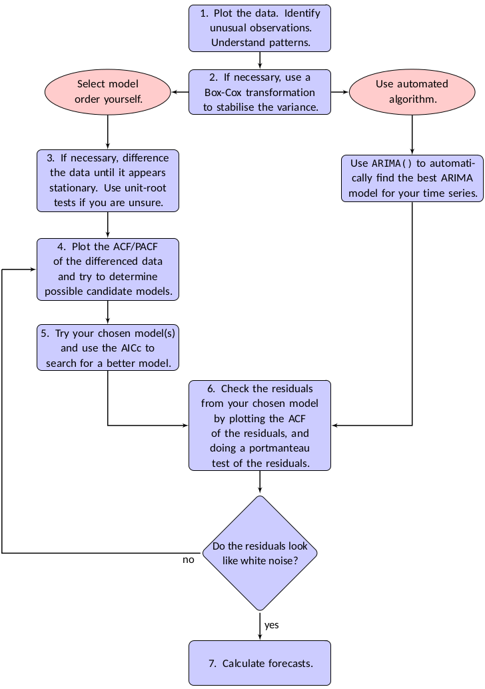

# Introducción

## ¿Qué son los modelos ARIMA?

- **ARIMA**: AutoRegressive Integrated Moving Average
- Familia de modelos para series de tiempo estacionarias
- Combinan tres componentes fundamentales:
  - **AR**: Autoregresivo (dependencia del pasado)
  - **I**: Integración (diferenciación para estacionariedad)
  - **MA**: Medias Móviles (dependencia de errores pasados)

**Notación**: ARIMA(p, d, q)

- p = orden autoregresivo
- d = orden de diferenciación
- q = orden de medias móviles


## Definición ARIMA

- Sabemos que un proceso ARMA(p, q) se define como :

$$
Y_t = c + \phi_1 Y_{t-1} + ... + \phi_p Y_{t-p} + \varepsilon_t + \theta_1 \varepsilon_{t-1} + ... + \theta_q \varepsilon_{t-q}
$$

- Ahora, **diferenciando** el proceso ARMA(p, q) tenemos el modelo ARIMA(d, p, q)
$$
y'_{t} = c + \phi_{1}y'_{t-1} + \cdots + \phi_{p}y'_{t-p}
     + \theta_{1}\varepsilon_{t-1} + \cdots + \theta_{q}\varepsilon_{t-q} + \varepsilon_{t} \\
\phi(L)(1-L)^d Y_t = c + \theta(L)\varepsilon_t
$$

- Donde $y'_{t}$ es la serie diferenciada y $L$ notación de rezago $Y_t$. El valor $c$ se le conoce como deriva, y representa el comportamiento tendencial de la serie a largo plazo.
- Para que un proceso ARIMA(p, d, q) sea válido:

1. **Estacionariedad**: Raíces de $\phi(z) = 0$ fuera del círculo unitario
2. **Invertibilidad**: Raíces de $\theta(z) = 0$ fuera del círculo unitario
3. **Parsimonia**: Priorizar un modelo sencillo, utilizando la menor cantidad de parámetros necesaria para explicar adecuadamente los datos.

### Modelos especiales 

| Modelo | Nombre | Ecuación |
|--------|--------|----------|
| ARIMA(0,0,0) sin constante | Ruido blanco | $Y_t = \varepsilon_t$ |
| ARIMA(0,1,0) sin constante | Camino aleatorio | $Y_t = Y_{t-1} + \varepsilon_t$ |
| ARIMA(0,1,0) con constante | Camino aleatorio con deriva | $Y_t = c + Y_{t-1} + \varepsilon_t$ |
| ARIMA(0,0,1) | Media movil | $Y_t = \varepsilon_t + \theta\varepsilon_{t-1}$ |
| ARIMA(1,0,0) | Autoregresivo | $Y_t =\phi \Delta Y_{t-1} + \varepsilon_{t-1}, |\phi| \le 1$ |
| ARIMA(0,1,1) | Suavizado exponencial simple | $\Delta Y_t = \varepsilon_t + \theta\varepsilon_{t-1}$ |
| ARIMA(1,1,0) | Autorregresivo integrado | $\Delta Y_t = \phi \Delta Y_{t-1} + \varepsilon_t, |\phi| \geq 1$ |

## Algoritmo de estimación modelo ARIMA(p, d, q)

- Metodología Box-Jenkins para la estimación de una ARIMA(p, d, q)

1. Grafique los datos e identifique cualquier observación inusual (valores atípicos).
2. Si es necesario, transforme los datos (utilizando una transformación de Box-Cox) para estabilizar la varianza.
3. Si los datos no son estacionarios, aplique primeras diferencias hasta que la serie sea estacionaria. Importante verificar prueba de Dickey-Fuller aumentada y Kwiatkowski-Phillips-Schmidt-Shin (KPSS). Usualmente $0 \leq d \leq 2$
4. Examine el ACF y PACF: ¿Es adecuado un modelo ARIMA(p,d,0) o un ARIMA(0,d,q)?
5. Pruebe los modelos seleccionados y utilice el Criterio de Información Akaike corregido para muestras pequeñas (AICc) para buscar un modelo mejor.
6. Verifique los residuos de su modelo elegido mediante el gráfico del ACF de los residuos y realizando una prueba Ljung-Box. Si no se comportan como ruido blanco, **intente con un modelo modificado**.
7. ***Una vez que los residuos parezcan ruido blanco, calcule los pronósticos.**

## Algoritmo ARIMA(p, d, q)

::::: {.callout-note}
:::

{height="900"}

- Fuente : Hyndman, R. J., & Athanasopoulos, G. (2021)

## Algoritmo Auto-ARIMA(p, d, q)

- **El proceso de seleccionar y estimar un modelo ARIMA(p, d, q) es iterativo** buscando finalmente un modelo con menor Criterio de Información Akaike (AICc) tal que sus residuos sean se comporten como ruido blanco.
$$
\varepsilon_t \sim \text{IID} N(0, \sigma^2)
$$

- Por lo anterior, existen paquetes que intentan automatizar este proceso.

1. El número de diferencias $0 \leq d \leq 2$ se determina mediante pruebas KPSS repetidas.
2. Los valores de $p$ y $q$ se eligen minimizando el AICc después de diferenciar los datos $d$ veces. En lugar de considerar cada combinación posible de $p$ y $q$, el algoritmo utiliza una búsqueda por pasos para recorrer el espacio de modelos.

**Se estiman cuatro modelos iniciales:**

- $\text{ARIMA}(0,d,0)$
- $\text{ARIMA}(2,d,2)$
- $\text{ARIMA}(1,d,0)$
- $\text{ARIMA}(0,d,1)$

3. Se incluye una constante (deriva) a menos que $d=2$. Si $d \leq 1$, también se ajusta un modelo adicional:

- $\text{ARIMA}(0,d,0)$ sin constante.

4. El mejor modelo (con el valor AICc más pequeño) ajustado en el paso **(2)** se establece como el **"modelo actual"**.

Se consideran variaciones sobre el modelo actual:

- variar $p$ y/o $q$ del modelo actual en $\pm 1$
- incluir/excluir $c$ del modelo actual.

5. El mejor modelo considerado hasta el momento (ya sea el modelo actual o una de estas variaciones) se convierte en el nuevo modelo actual.
6. Repetir el **paso 4** hasta que no se pueda encontrar un AICc más bajo.

## Esquema algoritmo Auto-ARIMA(p, d, q)

{height="500"}

- Fuente : Hyndman, R. J., & Athanasopoulos, G. (2021)

## Transformación de Box-Cox

- La transformación de Box-Cox es un método estadístico utilizado para modificar la distribución de los datos con el objetivo de que se aproximen más a una distribución normal y, especialmente en series de tiempo, para estabilizar la varianza (homocedasticidad).

- La transformación depende de un parámetro llamado $\lambda$ (lambda). Para una variable $y_t$​ (que debe ser estrictamente positiva), la transformación se define como:

$$
y(\lambda) = \begin{cases} 
\dfrac{y^\lambda - 1}{\lambda} & \text{si } \lambda \neq 0 \\[10pt] 
\ln(y) & \text{si } \lambda = 0 
\end{cases}
$$

| **Valor λ** | **Tipo de transformación** | **Ecuación** |
|:-----------:|:-------------------------:|:------------:|
| -2 | Cuadrado recíproco | $y' = \frac{1}{y^2}$ |
| -1 | Recíproco | $y' = \frac{1}{y}$ |
| -0.5 | Raíz cuadrada recíproca | $y' = \frac{1}{\sqrt{y}}$ |
| 0 | Logaritmo natural (ln y) | $y' = \ln(y)$ |
| 0.5 | Raíz cuadrada | $y' = \sqrt{y}$ |
| 1 | Sin transformación (identidad) | $y' = y$ |
| 2 | Cuadrado | $y' = y^2$ |

- La transformación logarítmica ($\lambda=0$) es la más frecuente en economía porque permite interpretar los cambios en la serie como tasas de crecimiento porcentual.

## Ejercicio 1. Pronostico del PIB de Colombia.

- Usando los datos del Banco Mundial, estime un modelo ARIMA válido acorde a la teoría entre 1960-2024. Finalmente, realice el pronostico del PIB de Colombia para los próximos 5 años.

## Pronóstico

Los pronósticos puntuales se pueden calcular siguiendo estos tres pasos:

- Expande la ecuación ARIMA de modo que $y_t$​ quede en el lado izquierdo y todos los demás términos en el derecho.
- Reescribe la ecuación sustituyendo $t$ por $T+h$.
- En el lado derecho de la ecuación, sustituye las observaciones futuras por sus pronósticos, los errores futuros por cero y los errores pasados por sus residuos correspondientes.

- Para un **ARIMA(1, 1, 1)** vemos que la ecuación de pronóstico que queda así:
$$
(1 - \phi L)(1 - L)y_t = (1 + \theta L)\varepsilon_t
$$

- **Paso 1: Expandir la ecuación**
$$
(1 - L - \phi L + \phi L^2)y_t = \varepsilon_t + \theta \varepsilon_{t - 1} \\
y_t - y_{t-1} - \phi y_{t-1} + \phi  y_{t-2} = \varepsilon_t + \theta \varepsilon_{t - 1} \\
\text{Despejando para } y_t \\
y_t =  (1 + \phi)y_{t-1} - \phi  y_{t-2} + \varepsilon_t + \theta \varepsilon_{t - 1}
$$

- **Paso 2: Sustituir $t$ por $T+1$ para el primer pronóstico**
$$
y_{T+1} =  (1 + \phi) y_{T + 1 - 1 } - \phi  y_{T + 1 - 2} + \varepsilon_{T + 1 + 1} + \theta \varepsilon_{T + 1 - 1} \\
y_{T+1} =  (1 + \phi ) y_{T} - \phi  y_{T - 1} + \varepsilon_{T + 2} + \theta \varepsilon_{T}
$$

- **Paso 3: Aplicar supuestos los errores $\varepsilon_{T + h} = 0$**

El pronóstico final para un paso adelante sería:
$$
\hat{y}_{T+1|T} =  (1 + \phi ) y_{T} - \phi  y_{T - 1} + \theta \varepsilon_{T}
$$

- El término $(1 + \phi) y_{T} - \phi  y_{T-1}$ captura la inercia del crecimiento (la parte integrada y autorregresiva)
- El término $\theta \varepsilon_T$ es el ajuste de error del modelo

- **Intervalo de confianza pronóstico**
$$
\hat{y}_{T+1|T} \pm 1.96\hat{\sigma}
$$

Donde $\hat{\sigma}$ es la desviación estándar de los errores del modelo 

## Ejemplo Pronóstico

- Consideremos un ARIMA(1, 1, 1) con $\phi = 0.4$ y $\theta = -0.3$
- El valor de la serie en $T$ es 100, y $T-1$ es 98
- El error de estimación $\varepsilon_T = 2$
- El pronóstico será :
$$
y_{T+1} =  (1 + \phi) y_{T} - \phi  y_{T-1} + \theta \varepsilon_T \\
y_{T+1} =  (1 + 0.4) \times 100 - 0.4  \times 98 - 0.3 \times 2 \\
y_{T+1} =  100.2
$$

- **Pregunta :** ¿cómo cambia este cálculo si intentamos pronosticar dos pasos adelante (T+2)?

## Solución pronóstico T+2

- Reemplazamos $T+2$ por $t$ en la ecuación de pronostico de ARIMA(1, 1, 1)  así:
$$
y_t =  (1 + \phi)y_{t-1} - \phi  y_{t-2} + \varepsilon_t + \theta \varepsilon_{t - 1} \\
y_{T+2} =  (1 + \phi) y_{T + 2 - 1 } - \phi  y_{T + 2 - 2} + \varepsilon_{T + 2 + 1} + \theta \varepsilon_{T + 2 - 1} \\
y_{T+2} =  (1 + \phi ) y_{T + 1} - \phi  y_{T} + \varepsilon_{T + 3} + \theta \varepsilon_{T + 1}
$$

- Conocemos a $y_{T}$ y sabemos que $\varepsilon_{T + h} = 0$. Finalmente, el término $y_{T + 1} = \hat{y}_{T+1|T}$ por tanto la ecuación de pronóstico es :
$$
\hat{y}_{T+2|T} = (1 + \phi ) \hat{y}_{T+1|T} - \phi  y_{T} \\
\hat{y}_{T+2|T} = (1 + 0.4) \times 100.2 - 0.4 \times 100 \\
\hat{y}_{T+2|T} = 100.28
$$

## Verificación del pronóstico con python

- Para un **ARIMA(1, 1, 1)** vemos que la ecuación de pronóstico que queda así:
$$
ARIMA(1, 1, 1) : y_t =  (1 + \phi)y_{t-1} - \phi  y_{t-2} + \varepsilon_t + \theta \varepsilon_{t - 1} \\
\phi = 0.4, \theta = -0.3
$$

```{python}
import numpy as np
import pandas as pd
import matplotlib.pyplot as plt
from statsmodels.tsa.arima_process import ArmaProcess
from statsmodels.tsa.arima.model import ARIMA

ar11 = np.array([1, -0.4])  # AR: (1 - 0.4L)
ma11 = np.array([1, 0.3])   # MA: (1 - 0.3L)
arma_process = ArmaProcess(ar11, ma11)
np.random.seed(42)
datos_estacionarios = arma_process.generate_sample(nsample=100)
y = np.cumsum(datos_estacionarios)

# Modelo ARIMA estimado (incluye los errores)
modelo_arima = ARIMA(y, order = (1, 1, 1)).fit()
print(modelo_arima.summary())

print("=" * 30 + "Pronóstico" + "=" * 30)
forecast = modelo_arima.get_forecast(steps=1)
print(f"Pronóstico T+1 con statsmodels ARIMA : {forecast.predicted_mean[0]}")

resid = modelo_arima.resid
forecast_formula = (1 + 0.4 ) * y[-1] - 0.4 * y[-2] - 0.3 * resid[-1]
print(f"Pronóstico T+1 con ecuación de pronóstico : {forecast_formula}")

```

## Comparación de Modelos

**Métricas de error**:

- **MAE** (Mean Absolute Error): $\frac{1}{n}\sum|y_i - \hat{y}_i|$
- **RMSE** (Root Mean Squared Error): $\sqrt{\frac{1}{n}\sum(y_i - \hat{y}_i)^2}$
- **MAPE** (Mean Absolute Percentage Error): $\frac{100}{n}\sum\frac{|y_i - \hat{y}_i|}{|y_i|}$


## Referencias

::: {.references style="font-size: 0.7em;"}
- Hyndman, R. J., & Athanasopoulos, G. (2021). *Forecasting: Principles and Practice*. 3rd ed. OTexts. Available at: https://otexts.com/fpp3/
- Hamilton, J. D. (1994). *Time Series Analysis*. Princeton University Press.
:::


## Pasos para estimar ARIMA en Python

### 1. **Cargar librerías y datos**

```python
import pandas as pd
import numpy as np
import matplotlib.pyplot as plt
from statsmodels.tsa.stattools import adfuller, kpss
from statsmodels.graphics.tsaplots import plot_acf, plot_pacf
from statsmodels.stats.diagnostic import acorr_ljungbox
from statsmodels.tsa.arima.model import ARIMA
from statsmodels.tsa.auto_arima import auto_arima
import warnings
warnings.filterwarnings('ignore')

# Cargar datos
datos = pd.read_csv('data.csv', parse_dates=['fecha'], index_col='fecha')
y = datos['variable']  # Serie de tiempo
```

### 2. **Análisis visual y pruebas de estacionariedad**

```python
# Graficar la serie original
fig, axes = plt.subplots(2, 1, figsize=(12, 6))
axes[0].plot(y)
axes[0].set_title('Serie Original')
axes[0].set_ylabel('Valor')

# ACF y PACF de la serie original
plot_acf(y, lags=40, ax=axes[1])
plt.tight_layout()
plt.show()

# Prueba Augmented Dickey-Fuller (ADF)
adf_result = adfuller(y)
print(f'ADF Statistic: {adf_result[0]:.6f}')
print(f'P-valor: {adf_result[1]:.6f}')
print(f'Estacionario: {"Sí" if adf_result[1] < 0.05 else "No"}')

# Prueba KPSS
kpss_result = kpss(y, regression='c')
print(f'KPSS Statistic: {kpss_result[0]:.6f}')
print(f'P-valor: {kpss_result[1]:.6f}')
```

### 3. **Aplicar diferenciación si es necesario**

```python
# Diferenciación de primer orden (d=1)
y_diff = y.diff().dropna()

# Verificar estacionariedad después de diferenciar
adf_diff = adfuller(y_diff)
print(f'ADF después de diferenciación: {adf_diff[1]:.6f}')

# Graficar autocorrelaciones de la serie diferenciada
fig, axes = plt.subplots(1, 2, figsize=(14, 4))
plot_acf(y_diff, lags=40, ax=axes[0], title='ACF - Serie Diferenciada')
plot_pacf(y_diff, lags=40, ax=axes[1], title='PACF - Serie Diferenciada')
plt.tight_layout()
plt.show()
```

### 4. **Identificar p y q usando ACF/PACF**

```python
# Basado en los gráficos de ACF y PACF:
# - Si ACF cae rápidamente → usar MA(q)
# - Si PACF cae rápidamente → usar AR(p)
# - Combinar para determinar ARIMA(p,d,q)

# Ejemplos de identificación:
# ACF con picos significativos en 1,2 y PACF cae rápido → ARIMA(0,1,2)
# PACF con picos significativos en 1,2 y ACF cae rápido → ARIMA(2,1,0)
```

### 5. **Estimar modelos ARIMA específicos**

```python
# Modelo ARIMA(p,d,q) manual
modelo = ARIMA(y, order=(1, 1, 1))
resultado = modelo.fit()

print(resultado.summary())

# AIC y BIC para comparación
print(f'AIC: {resultado.aic:.2f}')
print(f'BIC: {resultado.bic:.2f}')
```

### 6. **Usar Auto-ARIMA para automatizar**

```python
# Auto-ARIMA encuentra los parámetros óptimos automáticamente
auto_modelo = auto_arima(y, 
                         seasonal=False,      # No seasonal
                         stepwise=True,       # Búsqueda por pasos
                         trace=True,          # Mostrar progreso
                         error_action='ignore',
                         suppress_warnings=True,
                         max_p=5, max_q=5, max_d=2)

print(auto_modelo.summary())
print(f'Parámetros óptimos: ARIMA{auto_modelo.order}')
```

### 7. **Diagnóstico de residuos**

```python
# Gráficos de diagnóstico
resultado.plot_diagnostics(figsize=(12, 8))
plt.tight_layout()
plt.show()

# Prueba Ljung-Box (residuos deben comportarse como ruido blanco)
lb_test = acorr_ljungbox(resultado.resid, lags=[10], return_df=True)
print(f'Ljung-Box p-valor: {lb_test.iloc[0, 1]:.4f}')
print(f'Residuos son ruido blanco: {"Sí" if lb_test.iloc[0, 1] > 0.05 else "No"}')
```

### 8. **Realizar pronósticos**

```python
# Pronóstico fuera de muestra (próximos 12 períodos)
forecast_pasos = 12
forecast = resultado.get_forecast(steps=forecast_pasos)
forecast_df = forecast.conf_int(alpha=0.05)
forecast_df['predicción'] = forecast.predicted_mean

# Graficar
plt.figure(figsize=(12, 6))
plt.plot(y, label='Real')
plt.plot(forecast_df.index, forecast_df['predicción'], 'r-', label='Pronóstico')
plt.fill_between(forecast_df.index,
                 forecast_df.iloc[:, 0],
                 forecast_df.iloc[:, 1],
                 color='red', alpha=0.2, label='IC 95%')
plt.legend()
plt.title('Pronóstico ARIMA')
plt.show()

print(forecast_df)
```

## Pasos para estimar ARIMA en R

### 1. **Cargar librerías y datos**

```r
library(forecast)
library(ggplot2)
library(tseries)
library(lmtest)

# Cargar datos
datos <- read.csv('data.csv')
y <- ts(datos$variable, start = c(2010, 1), frequency = 12)  # Ejemplo: serie mensual desde 2010
```

### 2. **Análisis visual y pruebas de estacionariedad**

```r
# Graficar la serie original
autoplot(y) + labs(title = "Serie Original")

# ACF y PACF
par(mfrow = c(1, 2))
acf(y, main = "ACF - Serie Original")
pacf(y, main = "PACF - Serie Original")
dev.off()

# Prueba Augmented Dickey-Fuller (ADF)
adf_test <- adf.test(y)
print(adf_test)

# Prueba KPSS (alternativa)
kpss_test <- kpss.test(y, null = c("Level"))
print(kpss_test)
```

### 3. **Aplicar diferenciación si es necesario**

```r
# Diferenciación de primer orden (d=1)
y_diff <- diff(y, differences = 1)

# Verificar estacionariedad
adf_test_diff <- adf.test(y_diff)
print(adf_test_diff)

# Visualizar ACF y PACF después de diferenciar
par(mfrow = c(1, 2))
acf(y_diff, main = "ACF - Serie Diferenciada", lag.max = 40)
pacf(y_diff, main = "PACF - Serie Diferenciada", lag.max = 40)
dev.off()
```

### 4. **Identificar p y q usando ACF/PACF**

```r
# Interpretar gráficos ACF y PACF:
# - ACF con colas largas, PACF con pocos picos → AR(p)
# - PACF con colas largas, ACF con pocos picos → MA(q)
# - Si ambos tienen colas largas → ARMA(p,q)

# Función para explorar diferentes órdenes
ndiffs(y)           # Número de diferencias recomendadas
nsdiffs(y)          # Para series estacionales
```

### 5. **Estimar modelos ARIMA específicos**

```r
# Modelo ARIMA(p,d,q) manual
modelo <- arima(y, order = c(1, 1, 1))
print(modelo)

# AIC y BIC
AIC(modelo)
BIC(modelo)

# Resumen del modelo
summary(modelo)
```

### 6. **Usar auto.arima para automatizar**

```r
# auto.arima encuentra los parámetros óptimos automáticamente
auto_modelo <- auto.arima(y,
                          seasonal = FALSE,      # No estacional
                          stepwise = TRUE,       # Búsqueda por pasos
                          trace = TRUE,          # Mostrar progreso
                          max.p = 5, max.q = 5, max.d = 2)

print(auto_modelo)
summary(auto_modelo)

# Extraer orden ARIMA
cat("Parámetros óptimos: ARIMA", 
    paste(auto_modelo$arma[1], auto_modelo$d, auto_modelo$arma[2], sep = ","),
    "\n")
```

### 7. **Diagnóstico de residuos**

```r
# Gráficos de diagnóstico
checkresiduals(modelo)

# Prueba Ljung-Box (residuos deben ser ruido blanco)
Box.test(residuals(modelo), lag = 10, type = "Ljung-Box")

# Si p-valor > 0.05 → residuos son ruido blanco ✓
```

### 8. **Realizar pronósticos**

```r
# Pronóstico fuera de muestra (próximos 12 períodos)
forecast_pasos <- 12
pronostico <- forecast(modelo, h = forecast_pasos)

# Visualizar
autoplot(pronostico) +
  labs(title = "Pronóstico ARIMA",
       subtitle = "Incluye intervalo de confianza 95%")

# Tabla de pronósticos
print(pronostico)
```

### 9. **Comparación de modelos**

```r
# Estimar varios modelos
modelo1 <- arima(y, order = c(1, 1, 0))
modelo2 <- arima(y, order = c(0, 1, 1))
modelo3 <- arima(y, order = c(1, 1, 1))

# Comparar AIC
aic_comparacion <- data.frame(
  modelo = c("ARIMA(1,1,0)", "ARIMA(0,1,1)", "ARIMA(1,1,1)"),
  AIC = c(AIC(modelo1), AIC(modelo2), AIC(modelo3)),
  BIC = c(BIC(modelo1), BIC(modelo2), BIC(modelo3))
)

print(aic_comparacion)
# El modelo con menor AIC/BIC es preferible
```