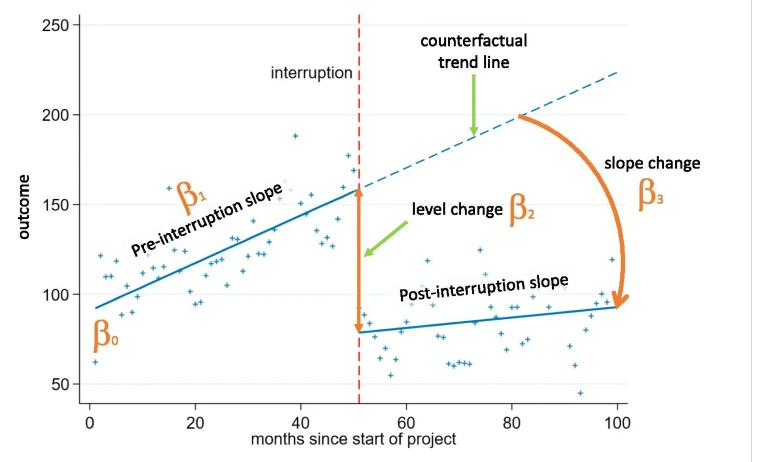

# Introducción

En esta unidad, se exploran los modelos de intervención y cómo detectar y manejar valores atípicos en las series temporales. Se analiza la importancia de detectar estos valores para mejorar la calidad de los modelos y las predicciones.

- Modelos de intervención: definición y aplicaciones
- Tipos de valores atípicos: aditivos, innovadores y multiplicativos
- Técnicas para la detección y corrección de valores atípicos
- Ejemplos de análisis de intervención y manejo de valores atípico

# Modelos de intervención: definición y aplicaciones

## Modelos de intervención

Las series temporales interrumpidas permiten evaluar el impacto de las intervenciones en ámbitos diversos como programas sociales, epidemiología, campañas de marketing, política de tasas e impuestos, regulaciones, etc. Existe básicamente dos patrones del cambio :

- **Cambio de nivel :** cambio brusco de la serie posterior de la intervención.
- **Cambio de tendencia :** cambio gradual en el crecimiento de la serie despúes de la intervención.

```{python}
import numpy as np
import matplotlib.pyplot as plt

x1_base = np.array([0, 10, 10, 20])
y1_base = np.array([5, 5, 10, 10])

x2_base = np.array([0, 10, 20])
y2_base = np.array([5, 5, 12])

fig, axs = plt.subplots(1, 2, figsize=(12, 6))
axs[0].plot(x1_base, y1_base)
axs[0].set_xlim(-1, 21)
axs[0].set_ylim(-1, 15)
axs[0].axvline(x=10, color='red', linestyle='-', linewidth=0.8, alpha=0.7)
axs[0].set_title("Cambio nivel")

axs[1].plot(x2_base, y2_base)
axs[1].axvline(x=10, color='red', linestyle='-', linewidth=0.8, alpha=0.7)
axs[1].set_xlim(-1, 21)
axs[1].set_ylim(-1, 15)
axs[1].set_title("Cambio de tendencia")

plt.show()
```

## Serie temporal interrumpida

- Está formado por dos períodos de múltiples observaciones registradas, antes y después de la intervención. Se trata de comprobar, si a partir del punto de intervención se ha **producido un cambio en el patrón de los datos.**

- Por lo general, se espera encontrar que la pendiente o el nivel de la serie sea contingente a la aplicación de la intervención. Este diseño recibe el nombre de serie temporal interrumpida, porque la inferencia causal se basa en detectar o descubrir un cambio abrupto en los valores de la variable dependiente.



$$
Y_t = \beta_0 + \beta_1 t + \beta_2 D_t + \beta_3 \left[t - T_I \right] D_t+ \varepsilon_t
$$

Donde :

- ${Y}_{t}$ es la serie de tiempo
- $D_t$ es una variable indicadora que representa el intervalo posterior a la interrupción: codificada como 0 en el período anterior a la interrupción y como 1 en el período posterior a la interrupción.
- 

## Ejemplos resueltos

- [Ver cuadernos de jupyther en Python/R]()

## Referencias

- Hyndman, R. J., & Athanasopoulos, G. (2021). *Forecasting: Principles and Practice*. 3rd ed. OTexts. Available at: https://otexts.com/fpp3/
- Turner, S.L., Karahalios, A., Forbes, A.B. et al. Comparison of six statistical methods for interrupted time series studies: empirical evaluation of 190 published series. BMC Med Res Methodol 21, 134 (2021). https://doi.org/10.1186/s12874-021-01306-w